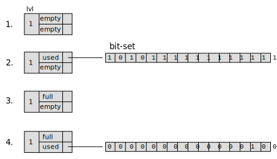
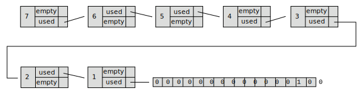
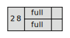
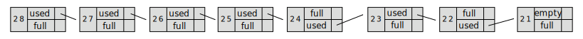

# BitmapTree - handle sparse bitarrays

A way to handle sparse [bitarrays](https://en.wikipedia.org/wiki/Bit_array)
a.k.a bitmaps.

The idea is to use `bit-sets` of a convenient size, like 16, 32 or 64, and
store partially used `bit-sets` in a tree structure. Full or empty
`bit-sets` *are not stored*.



1. The initial state. An empty bitarray

2. Some bits are allocated. bit-set size = 16

3. The remaining 2 bits in the `bit-set` are allocated and the set becomes full

4. Bit 18 is set


The idea seems similar to [RoaringBitmap](https://github.com/RoaringBitmap/RoaringBitmap)
but compresstion is sacrificed for simplicity and adaptation to the
IPAM usecase.


The max size of the bitarray is determined by the allowed number of
levels and the size of the bit-set (`S`) which must be a power of
2. If we want to have bitarray of size 2^32 we get;

```
 levels = 32 - log2(S) = 28 in our example
```

The example below shows a bitarray with S=16 where we set bit 1234
(0b10011010010);



A program that sets a bit must create level structures if necessary.
If the bit-set becomes full the program must remove the bit-set and
possibly also level structures.


## IPAM use-case

For [IPAM](https://en.wikipedia.org/wiki/IP_address_management) the
idea is to define the entire address range as "full" except for the
address ranges we want to manage. This lets us add any extra range
later by simply free it in the BitmapTree.

A BitmapTree defining the entire ipv4 range as "full" (bit-set size = 16)
looks like;



Now we free the 10.0.0.0/8 range;



BitmapTree is designed to be able to manage a /64 ipv6 address.


## Serialization

The tree is written and read like ...well, a binary tree, in the
traditional depth-first recursive way. 


